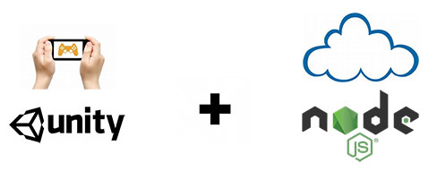

# socket.io client for Unity

Socket.IO Client Library for Unity (mono / .NET 2.0)



This is the Socket.IO Client Library for C#, which is ported from the [JavaScript client](https://github.com/Automattic/socket.io-client) version [1.1.0](https://github.com/socketio/socket.io-client/releases/tag/1.1.0).

[SocketIoClientDotNet](https://github.com/Quobject/SocketIoClientDotNet) by Quobject is a very good project, but it does not support Unity. 

So I spent a few overnights to port it to mono/.NET 2.0.

Now game developers can:
* use node.js to develop game server, easily deploy to cloud;
* use Unity to develop game client, enjoy the performance and powerful IDE.
* use websocket / socket.io to communicate between server/client.

## Installation

Downlaod socket.io.unitypackage and then import into Unity.

Or, only download the following files in Lib and put to Unity project:
* WebSocket4Net.dll
* SocketIoClientDotNet.dll
* Newtonsoft.Json.dll

## Usage
socket.io client for Unity has a similar api to those of the [JavaScript client](https://github.com/Automattic/socket.io-client).

```cs
using Quobject.SocketIoClientDotNet.Client;

var socket = IO.Socket("http://localhost");
socket.On(Socket.EVENT_CONNECT, () =>
{
	socket.Emit("hi");
	
});

socket.On("hi", (data) =>
	{
		Console.WriteLine(data);
		socket.Disconnect();
	});
Console.ReadLine();
```

## Features
This library supports all of the features the JS client does, including events, options and upgrading transport.

## Framework Versions
Mono, .NET 2.0

## Credit

Thanks to the authors of following projects:
* [SocketIoClientDotNet by Quobject](https://github.com/Quobject/SocketIoClientDotNet)
* [WebSocket4Net by Kerry Jiang](https://github.com/kerryjiang/WebSocket4Net)
* [Newtonsoft.Json by JamesNK](https://github.com/JamesNK/Newtonsoft.Json)

[MIT](http://opensource.org/licenses/MIT)
